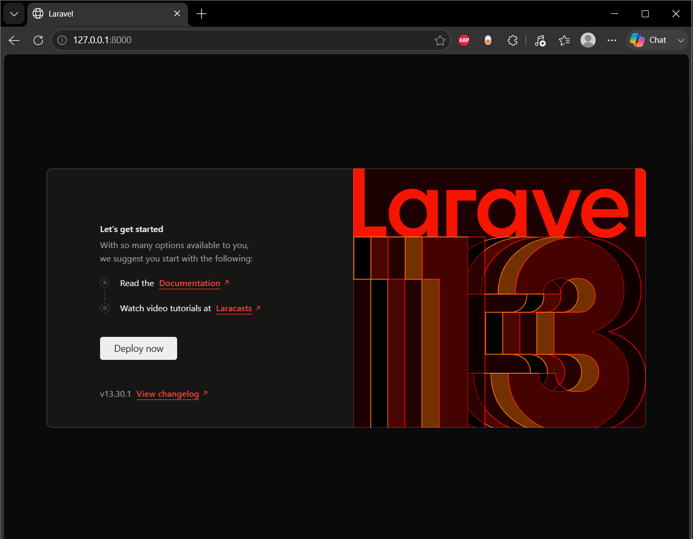

# Sistem Perpustakaan Digital Kampus (`app-perpustakaan`)

Aplikasi manajemen perpustakaan kampus berbasis Laravel 12 untuk mengelola data buku, anggota, dan transaksi peminjaman.

## Cara Menjalankan Project Secara Lokal
1. Pastikan PHP (>= 8.2), Composer, dan MySQL (XAMPP) sudah aktif.
2. Clone repository dan masuk ke direktori proyek:
   ```bash
   git clone https://github.com/AkihikoRalisTyan/app-perpustakaan.git
   cd app-perpustakaan

## Screenshot Tampilan Welcome

